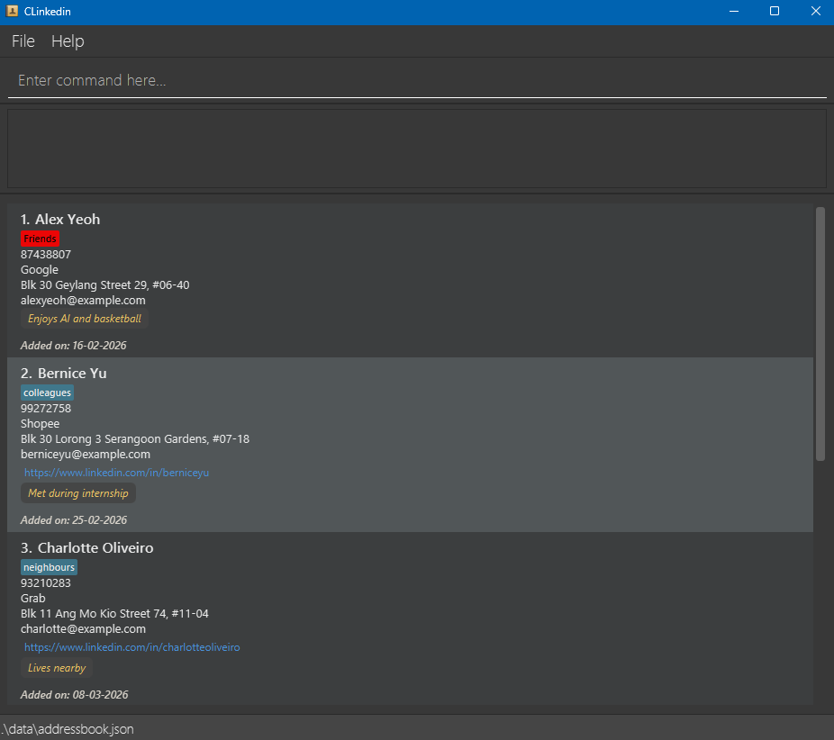

Project Name: CLInkedin

* This project is based on the AddressBook-Level3 project created by the [SE-EDU initiative](https://se-education.org). 
* It is named `CLInkedin` because it was initially created for students to manage their contacts.
* For the detailed documentation of this project, see the **[CLInkedin Website](https://ay2526s2-cs2103-t11-1.github.io/tp/)**.
* This project is a **part of the se-education.org** initiative. If you would like to contribute code to this project, see [se-education.org](https://se-education.org/#contributing-to-se-edu) for more info.
