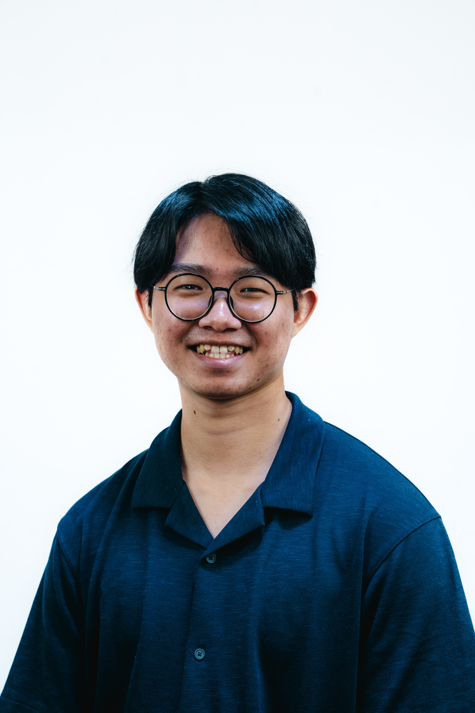

# About Us

We are a team based in the [School of Computing, National University of Singapore](http://www.comp.nus.edu.sg).

You can reach us at the email `seer[at]comp.nus.edu.sg`

## Project team

### Lee Ruo Xuan

[[homepage](http://www.comp.nus.edu.sg/~damithch)]
[[github](https://github.com/rxlee04)]
[[portfolio](team/rxlee04.md)]

* Role: Team Lead
* Responsibilities: Responsible for overall project coordination

### Jane Doe

[[github](http://github.com/johndoe)]
[[portfolio](team/johndoe.md)]

* Role: Team Lead
* Responsibilities: UI

### Zhe Ming

[[github](http://github.com/facelesssnowman)] [[portfolio](team/facelesssnowman.md)]

* Role: Documentation
* Responsibilities: Responsible for the quality of various project documents.

### Alastair Tan Choon Wei

[[github](http://github.com/alastair-tan-cw)]
[[portfolio](team/alastair-tan-cw.md)]

* Role: Testing
* Responsibilities: Ensures the testing of the project is done properly and on time.

### Lee Jun Hui

[[github](https://github.com/patrickstar1337)]
[[portfolio](team/patrickstar1337.md)]

* Role: Deliverables and deadlines
* Responsibilities: Ensure project deliverables are done on time and in the right format.
