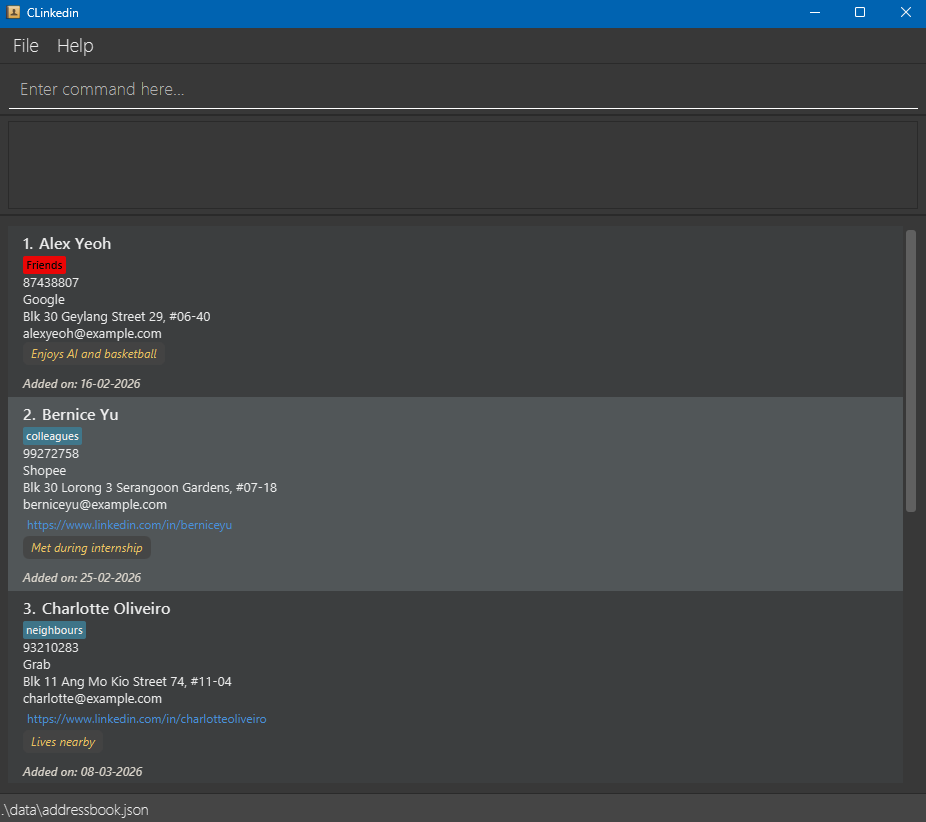

# CLinkedin User Guide

CLinkedin is a **desktop app for managing contacts, optimized for use via a Command Line Interface (CLI)** while still having the benefits of a Graphical User Interface (GUI). If you can type fast, CLinkedin can get your contact management tasks done faster than traditional GUI apps.

<!-- * Table of Contents -->
<page-nav-print />

--------------------------------------------------------------------------------------------------------------------

## Quick start

1. Ensure you have Java `17` or above installed in your Computer. 
   **Mac users:** Ensure you have the precise JDK version prescribed [here](https://se-education.org/guides/tutorials/javaInstallationMac.html).

1. Download the latest `.jar` file from [here](https://github.com/AY2526S2-CS2103-T11-1/tp/releases).

1. Copy the file to the folder you want to use as the _home folder_ for your CLinkedin.

1. Open a command terminal, `cd` into the folder you put the jar file in, and use the `java -jar clinkedin.jar` command to run the application. 
   A GUI similar to the below should appear in a few seconds. Note how the app contains some sample data. 
   

1. Type the command in the command box and press Enter to execute it. e.g. typing **`help`** and pressing Enter will open the help window. 
   Some example commands you can try:

    * `list` : Lists all contacts.

    * `add n/John Doe p/98765432 e/johnd@example.com a/John street, block 123, #01-01` : Adds a contact named `John Doe` to CLinkedin.

    * `delete 3` : Deletes the 3rd contact shown in the current list.

    * `clear` : Deletes all contacts.

    * `exit` : Exits the app.

1. Refer to the [Features](#features) below for details of each command.

--------------------------------------------------------------------------------------------------------------------

## Features

<box type="info" seamless>

**Notes about the command format:** 

* Words in `UPPER_CASE` are the parameters to be supplied by the user. 
  e.g. in `add n/NAME`, `NAME` is a parameter which can be used as `add n/John Doe`.

* Items in square brackets are optional. 
  e.g `n/NAME [t/TAG]` can be used as `n/John Doe t/friend` or as `n/John Doe`.

* Items with `…`​ after them can be used multiple times including zero times. 
  e.g. `[t/TAG]…​` can be used as ` ` (i.e. 0 times), `t/friend`, `t/friend t/family` etc.

* Parameters can be in any order. 
  e.g. if the command specifies `n/NAME p/PHONE_NUMBER`, `p/PHONE_NUMBER n/NAME` is also acceptable.

* Extraneous parameters for commands that do not take in parameters (such as `help`, `list`, `exit` and `clear`) will be ignored. 
  e.g. if the command specifies `help 123`, it will be interpreted as `help`.

* If you are using a PDF version of this document, be careful when copying and pasting commands that span multiple lines as space characters surrounding line-breaks may be omitted when copied over to the application.
</box>

### Viewing help : `help`

Shows a message explaining how to access the help page.

Format: `help`

### Adding a contact: `add`

Adds a contact to CLinkedin.

Format: `add n/NAME p/PHONE_NUMBER e/EMAIL a/ADDRESS [c/COMPANY] [l/LINK] [r/REMARK] [t/TAG]…​`

<box type="tip" seamless>

**Tip:** A contact can have any number of tags (including 0)
</box>

Examples:
* `add n/John Doe p/98765432 e/johnd@example.com a/John street, block 123, #01-01`
* `add n/Betsy Crowe t/friend e/betsycrowe@example.com a/Pasir Ris Drive p/1234567 t/teacher`

### Listing all contacts : `list`

Shows a list of all contacts in CLinkedin.

Format: `list`

### Editing a contact : `edit`

Edits an existing contact in CLinkedin.

Format: `edit INDEX [n/NAME] [p/PHONE] [e/EMAIL] [a/ADDRESS] [t/TAG]…​`

* Edits the contact at the specified `INDEX`. The index refers to the index number shown in the displayed contact list. The index **must be a positive integer** 1, 2, 3, …​
* At least one of the optional fields must be provided.
* Existing values will be updated to the input values.
* When editing tags, the existing tags of the contact will be removed i.e adding of tags is not cumulative.
* You can remove all the contact’s tags by typing `t/` without specifying any tags after it.

Examples:
*  `edit 1 p/91234567 e/johndoe@example.com` Edits the phone number and email address of the 1st contact to be `91234567` and `johndoe@example.com` respectively.
*  `edit 2 n/Betsy Crower t/` Edits the name of the 2nd contact to be `Betsy Crower` and clears all existing tags.

### Locating contacts by name: `find`

Finds contacts whose names contain any of the given keywords.

Format: `find KEYWORD [;MORE_KEYWORDS]`

* The search is case-insensitive. e.g `hans` will match `Hans`
* The order of the keywords matter. e.g. `Hans Bo` will not match `Bo Hans`
* Only the name is searched.
* Partial words will be matched e.g. `Han` will match `Hans`
* Contacts containing the entire keyword will be returned (i.e. `.contains()` search).
  e.g. `Hans Bo` will return `Hans Bobber`, but not `Hans Lim`

Examples:
* `find John` returns `john` and `John Doe`
* `find alex david` returns `Alex David` only

### Deleting a contact : `delete`

Deletes the specified contact from CLinkedin.

Format: `delete INDEX`

* Deletes the contact at the specified `INDEX`.
* The index refers to the index number shown in the displayed contact list.
* The index **must be a positive integer** 1, 2, 3, …​
* Deleted contacts are not permanently removed immediately.
* Deleted contacts are stored and can be viewed using the `deleted` command.
* Contacts will be permanently removed after 7 days.

Examples:
* `list` followed by `delete 2` deletes the 2nd contact in CLinkedin.
* `find Betsy` followed by `delete 1` deletes the 1st contact in the results of the `find` command.

### Viewing deleted contacts : `deleted`

Shows a list of recently deleted contacts.

Format: `deleted`

* Displays all contacts that were deleted within the last 7 days.
* Each deleted contact includes the date and time it was deleted.
* Contacts that exceed 7 days from deletion will no longer be shown.

Examples:
* `deleted`

### Restoring a contact : `restore`

Restores a contact from the deleted list.

Format: `restore INDEX`

* Restores the contact at the specified `INDEX` from the deleted contacts list.
* The index refers to the index number shown in the `deleted` list.
* The index **must be a positive integer** 1, 2, 3, …​
* The restored contact will be added back to CLinkedin.
* If a tag associated with the contact has been removed or renamed before restoration, the contact will be restored without that tag.
* If restoring the contact results in duplicate phone number or existing contact conflicts, the restore will fail.
* Once restored, the contact will be removed from the deleted list.

Examples:
* `deleted` followed by `restore 1`

### Creating a tag: `tag create`

Creates a new tag with an optional color.

Format: `tag create TAG_NAME [COLOR]`

* Creates a tag with the specified `TAG_NAME`.
* Tag names are **case-sensitive** (e.g. `friend` and `Friend` are treated as different tags).
* Duplicate tag names are **not allowed**.
* If `COLOR` is not provided, a default color will be assigned.

<box type="tip" seamless>

**Tip:** Valid color formats include plain names, hexadecimal, or rgb values. 
Examples: `orange`, `#ff6688`, `rgb(255,102,136)`

</box>

Examples:
* `tag create friend`
* `tag create colleague blue`
* `tag create vip #ff6688`

### Assigning/Unassigning a tag: `tag assign`, `tag unassign`

Assign/remove a tag to/from 1 or multiple contacts at once.

Format: `tag assign INDEX[,INDEX]... TAG_NAME`, `tag unassign INDEX[,INDEX]... TAG_NAME`

* Assigns/remove `TAG_NAME` tag to/from multiple contacts.
* If the index provided is **out of range** or **negative** or **zero**, an error message will be shown.
* If the tag does not exist, an error message will be shown.

Examples:
* `tag assign 1 friend`
* `tag assign 1,4,6 friend`
* `tag unassign 1 friend`
* `tag unassign 1,4,6 friend`

### Deleting a tag: `tag delete`

Deletes a tag and removes it from all contacts.

Format: `tag delete TAG_NAME`

* Deletes the tag with the specified `TAG_NAME`.
* The tag will be removed from all contacts that currently have it.
* Only the specified tag is removed; other tags on the contact remain unchanged.
* If the tag does not exist, an error message will be shown.

Examples:
* `tag delete friend`

### Adding color to a tag: `tag color`

Adds a color to a tag.

Format: `tag color TAG_NAME [COLOR]`

* Adds a valid color to the specified `TAG_NAME`.
* A valid color is any plain text, rgb value, or hex value as specified in the JavaFX documentation of `Color.web(String colorString)`.
* If the tag does not exist, an error message will be shown.
* If the color is invalid, an error message will be shown.

Examples:
* `tag color friends blue`
* `tag color enemy rgb(255,0,0)`
* `tag color coworker #343434`

### Filter contacts by tag: `tag show`

Show contacts that have a specific tag.

Format: `tag show TAG_NAME`

* The list will be filtered to show contacts that have `TAG_NAME`.
* Filters based on a single tag only.
* If the tag does not exist, an error message will be shown.

Examples:
* `tag show friends`
* `tag show coworkers`

### Clearing all entries : `clear`

Clears all entries from CLinkedin.

Format: `clear`

### Exiting the program : `exit`

Exits the program.

Format: `exit`

### Saving the data

CLinkedin data are saved in the hard disk automatically after any command that changes the data. There is no need to save manually.

### Editing the data file

CLinkedin data are saved automatically as a JSON file `[JAR file location]/data/clinkedin.json`. Advanced users are welcome to update data directly by editing that data file.

<box type="warning" seamless>

**Caution:**
If your changes to the data file makes its format invalid, CLinkedin will discard all data and start with an empty data file at the next run.  Hence, it is recommended to take a backup of the file before editing it. 
Furthermore, certain edits can cause CLinkedin to behave in unexpected ways (e.g., if a value entered is outside the acceptable range). Therefore, edit the data file only if you are confident that you can update it correctly.
</box>

--------------------------------------------------------------------------------------------------------------------

## FAQ

**Q**: How do I transfer my data to another Computer? 
**A**: Install the app in the other computer and overwrite the empty data file it creates with the file that contains the data of your previous CLinkedin home folder.

--------------------------------------------------------------------------------------------------------------------

## Known issues

1. **When using multiple screens**, if you move the application to a secondary screen, and later switch to using only the primary screen, the GUI will open off-screen. The remedy is to delete the `preferences.json` file created by the application before running the application again.
2. **If you minimize the Help Window** and then run the `help` command (or use the `Help` menu, or the keyboard shortcut `F1`) again, the original Help Window will remain minimized, and no new Help Window will appear. The remedy is to manually restore the minimized Help Window.

--------------------------------------------------------------------------------------------------------------------

## Command summary

Action              | Format, Examples
--------------------|----------------------------------------------------------------------------------------------------------------------------------------------------------------------
**Add**             | `add n/NAME p/PHONE_NUMBER e/EMAIL a/ADDRESS [c/COMPANY] [l/LINK] [r/REMARK] [t/TAG]…​`   e.g., `add n/James Ho p/22224444 e/jamesho@example.com a/123 Clementi Rd t/friend t/colleague`
**Clear**           | `clear`
**Delete**          | `delete INDEX`  e.g., `delete 3`
**Edit**            | `edit INDEX [n/NAME] [p/PHONE_NUMBER] [e/EMAIL] [a/ADDRESS] [c/COMPANY] [l/LINK] [r/REMARK] [t/TAG]…​`  e.g., `edit 2 n/James Lee e/jameslee@example.com`
**Find**            | `find KEYWORD [MORE_KEYWORDS]`  e.g., `find James Jake`
**List**            | `list`
**Deleted**         | `deleted`
**Restore**         | `restore INDEX`  e.g., `restore 1`
**Tag Create**      | `tag create TAG_NAME [COLOR]`  e.g., `tag create friend blue`
**Tag Assign**      | `tag assign INDEX[,INDEX]... TAG_NAME`  e.g., `tag assign 1,4,6 friend`
**Tag Unassign**    | `tag unassign INDEX[,INDEX]... TAG_NAME`  e.g., `tag unassign 1,4,6 friend`
**Tag Delete**      | `tag delete TAG_NAME`  e.g., `tag delete friend`
**Help**            | `help`
